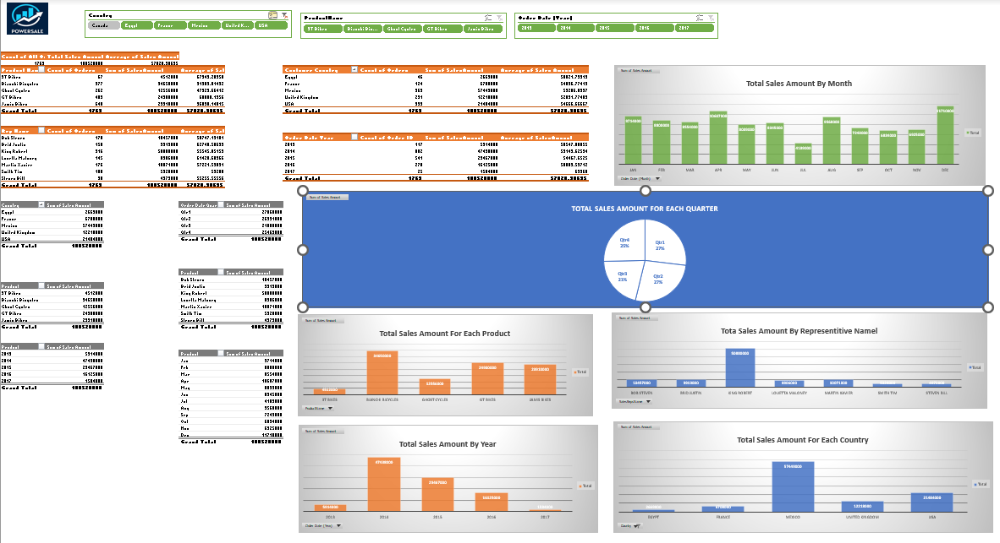

# 📊 Excel Sales Dashboard Project

This is an interactive sales dashboard project built using **Microsoft Excel**. It includes data modeling, pivot tables, charts and slicers.

## 📌 Project Objective

- A fact table (`OrdersDetails.xlsx`) with sales orders per sales rep
- Dimension tables (`SalesData.xlsx`) for Customers, Products, and Reps

### Visualizations:
- 📊 Column Chart: Total Sales by Country
- 🥧 Pie Chart: Total Sales by Quarter
- 📈 Line Chart: Monthly Sales Trend

### Interactivity:
- 🧩 Slicers to filter by:
  - Rep Name
  - Product Name
  - Year of Order Date

## 🎯 Features

- Fully interactive Excel dashboard
- PivotTables and PivotCharts with calculated fields
- Clean layout with hidden gridlines
- Company logo added for branding
- User-friendly design with slicers and summaries

## 🔍 Key Insights

- 🏆 **Mexico** was the highest-grossing country, contributing a total of **57449000** in sales.
- 🚲 **Bianche Bikes** generated the highest overall sales among all products.
- 🧑‍💼 **King Robert** stood out as the top-performing sales representative.
- 📈 Sales peaked in **August** and **December**, showing clear **seasonal patterns**.
- 📊 The year **2014** recorded the **strongest sales performance** overall.

## 🖼️ Dashboard Preview

## 🛠️ Tools Used

- Microsoft Excel
- Power Query

## 📎 Notes

- All data is fictional and used for learning purposes.

---

