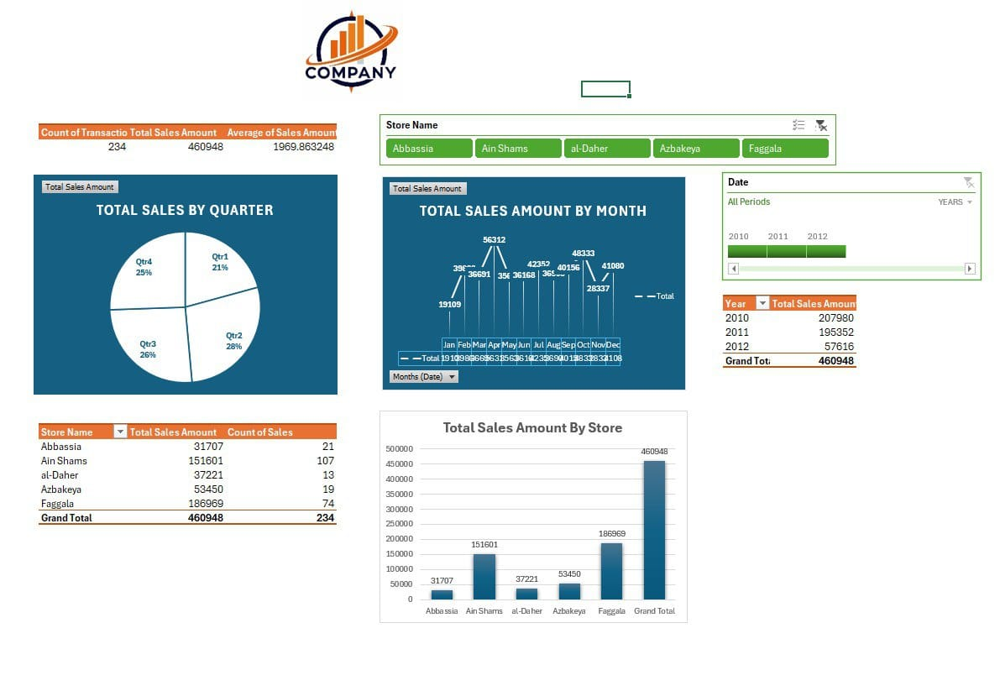

# 📊 Store Sales Dashboard (Excel Reporting Project)

> ✅ Built using Microsoft Excel and Power Query as part of a Microsoft-certified data analysis course.

## 📘 Project Story

As part of a data analysis challenge, I was provided with a raw Excel file containing **sales data across multiple stores over several years**. My goal was to transform this data into a clean, interactive, and insightful dashboard — fully inside Excel.

The dataset included:
- Sales transactions across 6 different Stores
- Sales amounts spread over months and years
- Each row representing a transaction record

But the data wasn’t ready to use directly…

---

## 🔧 Data Transformation

Before diving into analysis, I used **Power Query** to:
 🔄 **Unpivot the Store_Code and Store_Name columns** to transform the stores into row-based format
- 🧼 Clean the data to create a tabular fact table for analysis

This transformation allowed for more flexible time-based analysis and cleaner pivoting in Excel.

---

## 📊 Dashboard Summary

The final dashboard includes a combination of **pivot tables**, **pivot charts**, and **slicers** for full interactivity.

### ✅ Key KPIs (Top Row Summary):
- **Total Transactions**: `234`
- **Total Sales Amount**: `460,948`
- **Average Sales per Transaction**: `1,969.86`

---

## 🔍 Key Insights

- 🏬 **Faggala** store achieved the highest sales: `186,969` from `74` transactions
- 🏆 **Q2** was the best performing quarter, contributing **28%** of the total sales
- 📉 **January** showed the lowest monthly sales (`19,109`), while **May** peaked at `56,312`
- 🔢 Sales have been relatively consistent across years, with **2010** being the strongest year

---

## 🧩 Interactivity

- ✅ **Slicer** by **Store Name** — allows focused analysis per store
- ✅ **Timeline Slicer** by **Year** — helps to filter the dashboard by sales year
- ✅ All slicers are fully linked to all pivot tables and charts for a seamless user experience

---
## 🖼️ Dashboard Preview

---

## 🛠️ Tools Used

- Microsoft Excel
- Power Query (Unpivot & Data Cleaning)
- Pivot Tables & Pivot Charts
- Slicers & Timeline Filters

---

## 📎 Notes

- All data used is for demo/educational purposes.
- Designed to simulate real-world store performance tracking.

---

