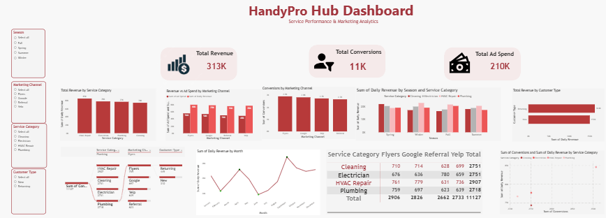

# 🔧 Handy Pro Hub Dashboard

## 📌 Overview

This project was delivered as part of a freelance engagement for a service-based business. The dashboard provides a comprehensive analysis of service performance, revenue trends, and customer interactions across different categories.

## 🎯 Business Objectives

* Monitor performance across different service categories
* Analyze revenue and conversion trends
* Identify top-performing services
* Evaluate customer acquisition channels
* Support strategic business decisions

  

## 📊 Key Insights

* HVAC Repair and Plumbing are the top-performing service categories
* Clear variation in performance across different time periods
* Customer acquisition channels such as Google and referrals play a major role
* Conversion trends highlight opportunities for optimization

## 📈 Dashboard Features

* Service category performance comparison (HVAC, Plumbing, Electrical)
* Revenue and conversion trends over time
* Customer acquisition channel analysis (Google, Referrals, etc.)
* Monthly performance tracking
* Interactive filters for deep analysis

## 🛠️ Tools & Technologies

* Power BI
* Power Query
* DAX
* Data Modeling
* 
## 💼 My Role

* Collected and cleaned raw data
* Built the data model
* Designed and developed the full interactive dashboard
* Translated business requirements into actionable insights

## 🚀 Outcome

The dashboard enabled the client to clearly identify high-performing services and optimize their marketing and operational strategies based on data-driven insights.

## 📂 Project Structure

* `/data` → Raw & processed data
* `/dashboard` → Power BI file
* `/images` → Dashboard screenshots

## 📎 Notes

This project reflects real-world freelance experience in business intelligence, data visualization, and performance analysis.

