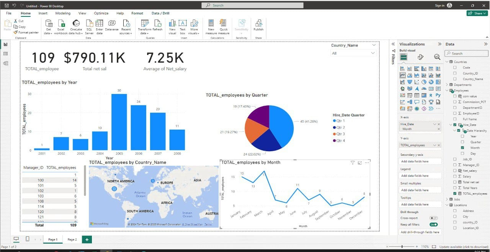

# Employee Insights & HR Analytics Dashboard

## 📖 Project Story  
This Power BI project analyzes employee, department, job, and location data to provide meaningful insights for HR and management decision-making.  

The dataset integrates multiple sources (Employees, Departments, Jobs, Locations, Countries) to give a **360° view of the workforce** — covering salaries, hiring, job roles, and global distribution.  

The main goal is to help:  
- HR managers monitor employee distribution across departments and countries.  
- Executives evaluate salary structures compared to job ranges.  
- Business leaders understand workforce demographics and identify areas for optimization.  

---
## Dashboard Link
https://app.powerbi.com/reportEmbed?reportId=27a68e44-4a08-447e-a681-3e5139d8e5bc&autoAuth=true&ctid=77255288-5298-4ea5-81aa-a13e604c30ac
---
## 📷 Dashboard Preview  
  

---

## 📊 Key Insights  

1. **Employee Distribution**  
   - Employees are spread across multiple departments such as IT, Sales, Administration, and Marketing.  
   - IT department shows multiple employees reporting under the same manager, reflecting team clustering.  

2. **Salary Analysis**  
   - Some employees’ salaries fall **below the defined job salary range** (e.g., IT Programmers).  
   - Sales-related roles benefit from commissions, making their earning potential higher than fixed-salary jobs.  
   - A significant salary gap exists between executives and technical staff.  

3. **Department Insights**  
   - Departments are tied to specific office locations and countries.  
   - Administration and Marketing appear centralized, while IT is spread across multiple regions.  

4. **Managerial Structure**  
   - Reporting hierarchies show clear manager–employee relationships.  
   - Some departments have **flat structures**, while others have deeper hierarchies.  

5. **Geographical Distribution**  
   - Offices are located across countries such as Italy and Japan.  
   - Mapping employees to countries highlights **regional hiring trends** and workforce distribution.  

---

