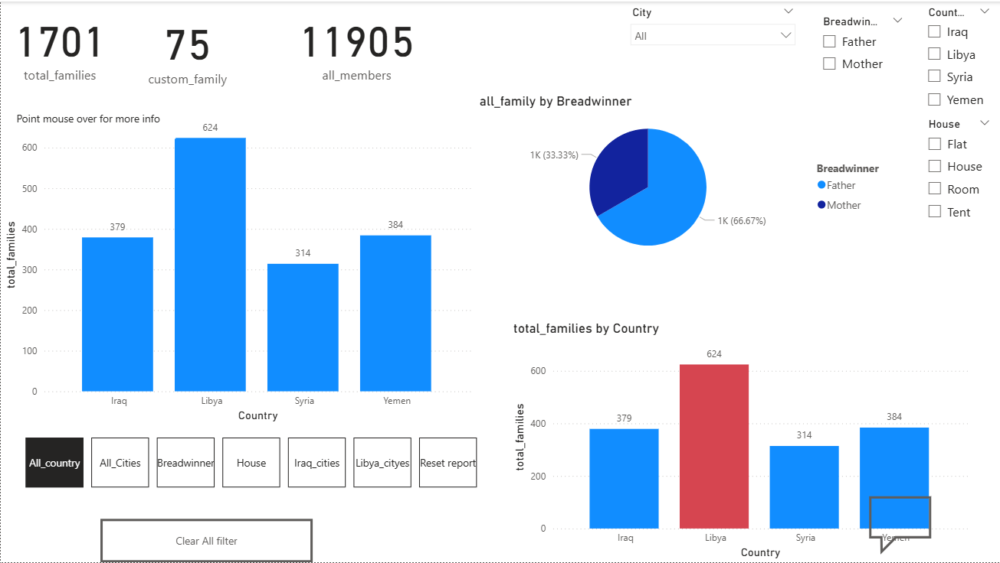

# Household Socio-Economic & Needs Analysis Dashboard  

## 📖 Project Story  
This project analyzes the living conditions and needs of households across multiple countries using Power BI. The dataset merges demographic and socio-economic details (location, family composition, breadwinner, employment status, income) with household needs information (housing type, electricity, water source, and essential requirements such as food, clothing, education, and financial support).  

By developing an interactive Power BI dashboard, the project enables users to:  
- Explore the geographic distribution of households.  
- Assess employment status of breadwinners and its relationship with income.  
- Understand the availability of key infrastructure services such as electricity and water.  
- Identify and prioritize the most pressing needs of households.  

This analysis provides actionable insights that can guide NGOs, policy makers, and humanitarian organizations in resource allocation, needs prioritization, and strategy development.  

---

## 📊 Dashboard Preview  

  

## 📊 Key Insights  

1. **Household Demographics**  
   - Larger household sizes are concentrated in cities such as *Tall Afar*.  
   - The majority of families are father-led, highlighting a consistent household structure across regions.  

2. **Income & Employment**  
   - Unemployed breadwinners are strongly correlated with very low or absent household income.  
   - A clear income disparity exists between employed and unemployed households, with employment offering more stability but not always sufficient income to meet needs.  

3. **Access to Services**  
   - Electricity supply is highly fragmented, with households relying on public networks, solar energy, or private generators.  
   - Water sources vary widely, including public networks, trucked water, wells, and rivers, underlining significant inequalities in infrastructure access.  

4. **Household Needs Profile**  
   - Food security and financial assistance emerge as the most urgent needs across households.  
   - Secondary needs such as clothing and education are also present, emphasizing the broader impact of economic hardship on quality of life.  

5. **Employment and Needs Correlation**  
   - Households with employed breadwinners tend to report fewer financial needs compared to those with unemployed breadwinners.  
   - However, even among employed households, food and clothing shortages remain a recurring concern, suggesting that income levels are often insufficient to cover basic needs.
  
  
